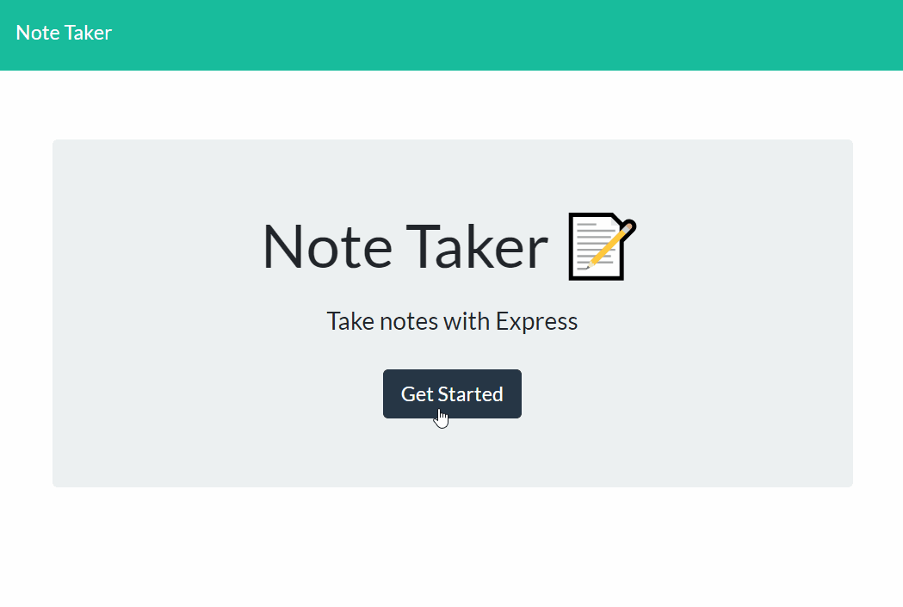

# Note Keeper

[](https://opensource.org/licenses/ISC)

## Table of Contents
* [Description](#Description)
  * [Posting and Deleting](#posting-and-deleting)
  * [Further Possibilities](#Further-Possibilities)
  * [Built With](#built-with)
* [Installation](#Installation)
* [Usage](#Usage)
* [License](#License)
* [Contributing](#Contributing)
* [Questions](#Questions)

## Description
A [Node.js application](https://radiant-shelf-20945.herokuapp.com/) to write, save, and delete notes. The front-end elements were provided as part of a Full Stack Coding Boot Camp assignment, but the back-end and the connection between them are the focus of this project.



The notes saved by this app are kept in a JSON file on a server, to provide better persistence and portability than localStorage could provide. My task was to build the server using Express, and provide handling functions for the front-end's API calls.

### Posting and Deleting
The GET routes to serve HTML files to the front-end were the simplest to build, since there isn't much to code for them. The complex part was handling the POST requests in a way that would assist in later handling for DELETE requests. With a little research, I found [an npm package that creates simple unique IDs](https://www.npmjs.com/package/uniqid) to associate with every note. Using UniqID, I add an identifier to each note the app receives as it POST request comes in. Then, when the user sends a DELETE request, the ID is used to find the correct object in the saved JSON array.

### Further Possibilities
If I were to change anything in this app, I would want to add an editing feature that allowed users to edit notes they have already saved. Doing so will take a bit of restructuring in the front-end to still provide an intuitive user interface, and so is a project for a later date.

### Built With

* Node.js
    * [UniqID](https://www.npmjs.com/package/uniqid)
* Express
* Class-provided HTML, CSS, and JS.

## Installation
To install app dependencies, run this command in your terminal:
```
npm i
```

## Usage
Find the [live version on Heroku](https://radiant-shelf-20945.herokuapp.com/) at https://radiant-shelf-20945.herokuapp.com/

## License
This project uses the ISC license. For more details, visit [this link](https://opensource.org/licenses/ISC).

## Contributing
Create a fork and send a pull request, or send me an email!

## Questions
If you have questions to ask or issues to report, please visit the [GitHub repository](https://github.com/ziieng/NoteKeeper) for this project, [my GitHub profile](https://github.com/ziieng), or send me an email at cjengelhardt@gmail.com.